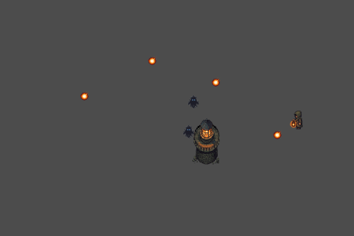
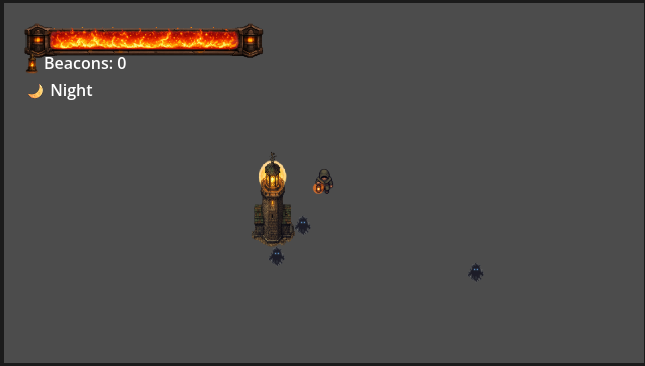

# 🌟 Last Light

> **A 2D top-down survival & base-defense game built with Godot 4.7**

<p align="center">
  
</p>

**Last Light** is a pixel-art survival and base-defense game where you play as **The Keeper**, guardian of the world's final lighthouse.

As darkness engulfs the world, shadow creatures emerge every night to extinguish humanity's last source of light. Defend the lighthouse, collect Beacons from defeated enemies, repair the flame during the day, and survive increasingly dangerous nights.

> 📖 **Story, lore, and design documentation:** `Docs/GameDesign.md`

---

# ✨ Current Features

## 🧍 Player

- 4-direction movement
- Mouse aiming
- Fireball shooting
- Directional sprites
- Beacon inventory

---

## ⚔️ Combat

- Projectile collision
- Enemy health system
- Enemy death
- Beacon drops on enemy death
- Automatic beacon collection

---

## 🏰 Lighthouse

- Central objective
- Health system
- Custom HP Bar
- Repair mechanic
- Repairs consume Beacons
- Cannot repair at full HP
- Repair available only during Day
- Game Over when destroyed

---

## 👾 Enemies

### ShadowCrawler

- Moves toward the lighthouse
- Stops and attacks in range
- Periodic damage
- Health system
- Retreats during Dawn
- Despawns after reaching the Veil
- Drops Beacons on death

---

## 🌙 Day & Night Cycle

Current cycle:

```text
☀ Day
   ↓
🌇 Dusk
   ↓
🌙 Night
   ↓
🌅 Dawn
   ↓
☀ Day
```

### Behaviour

| Phase | Behaviour |
|--------|-----------|
| ☀ Day | Repair lighthouse |
| 🌇 Dusk | Transition into darkness |
| 🌙 Night | Enemy spawning begins |
| 🌅 Dawn | Enemies retreat into the Veil |

---

## 💎 Beacon System

- Beacons drop from defeated enemies
- Automatically collected by the player
- Stored in player inventory
- Required to repair the lighthouse
- One repair consumes one Beacon

---

## 📺 User Interface

- Lighthouse custom HP Bar
- Lighthouse HP text
- Beacon counter
- Current phase indicator

---

# 🎮 Controls

| Input | Action |
|:------:|--------|
| **W A S D** | Move |
| **Mouse** | Aim |
| **Left Click** | Shoot |
| **E** | Repair Lighthouse |

---

# 🛠 Built With

- Godot Engine **4.7**
- GDScript

---

# 📂 Project Structure

```text
Assets/
    Sprites/
    UI/

Docs/
    Concepts_art/
    GameDesign.md

Scenes/
    Beacon/
    Enemies/
    EnemySpawner/
    GameManager/
    HUD/
    LightHouse/
    Player/
    Projectiles/

project.godot
```

---

# 🚧 Development Roadmap

## Gameplay

- [ ] Multiple enemy types
- [ ] Progressive difficulty
- [ ] Boss encounters
- [ ] Lighthouse upgrades
- [ ] Crafting & upgrades

## Visuals

- [ ] Dynamic lighting
- [ ] Veil / Fog of Darkness
- [ ] Particle effects
- [ ] Day & Night ambience
- [ ] Camera shake
- [ ] Animated UI

## Audio

- [ ] Background music
- [ ] Ambient sounds
- [ ] Combat SFX

## Polish

- [ ] Main Menu
- [ ] Pause Menu
- [ ] Save System
- [ ] Settings Menu

---

# 🚀 Running the Project

1. Clone the repository.
2. Open the project with **Godot Engine 4.7** or later.
3. Run `main.tscn`.

---

# 📌 Current Progress

### ✅ Implemented

- Player movement
- Combat system
- Lighthouse health & repair
- Enemy AI
- Day/Night cycle
- Enemy retreat system
- Beacon economy
- HUD
- Custom HP Bar
- Game Over system

---

# 📸 Screenshots

## Enemy Spawn

<p align="center">
  
</p>

---

## Combat

<p align="center">
  
</p>

---

## License

This project is currently intended for **educational and portfolio purposes**.

---

## Developer Notes

This project is being developed to learn:

- Game Programming
- Godot Engine
- Gameplay Architecture
- AI Behaviour
- UI Systems
- Pixel Art Workflow
- Software Design
